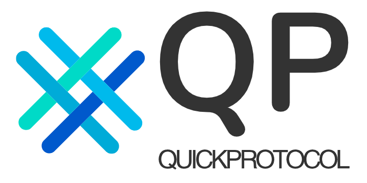

# QuickProtocol
A simple protocol for TCP,Pipeline,SerialPort,WebSocket. 

| Language      | Repo |
| ----------- | ----------- |
| C#      | https://github.com/QuickProtocol/QuickProtocol_CSharp       |
| Java   | https://github.com/QuickProtocol/QuickProtocol_Java        |
| Vala   | https://github.com/QuickProtocol/QuickProtocol_Vala        |
